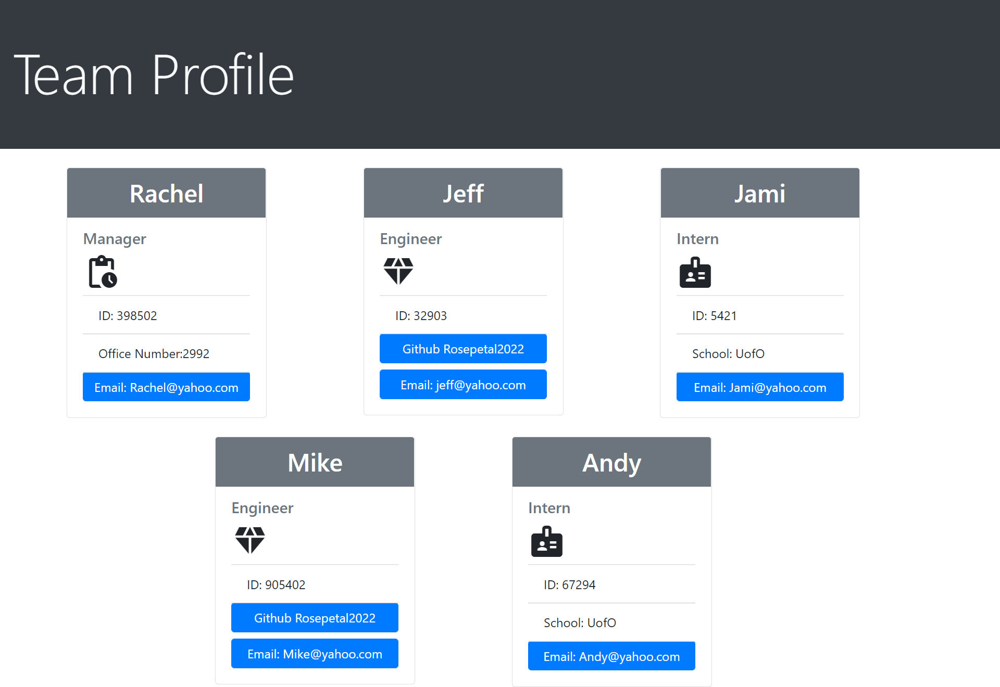

# Team Profile Generator

  * [Description](#description)
  * [Installation](#installation)
  * [Usage](#usage)
  * [Languages used](#languages)
  * [Questions](#email)
  
  
  ## Description 

 An app to create an HTML webpage that displays summaries of each employee for a software engineering team.  

  ## Installation

  npm install

  ## Usage

  Video 1- Test suites and the test results:
  https://drive.google.com/file/d/10tGot_dIdU431TFtyni5-iYdo9-k1H6r/view

  Video 2- The prompt questions for the employee team:
  https://drive.google.com/file/d/1yo3WnDdaMrIb3el61TAucmmsWleC6Cl5/view

  video 3- The generated page 
  https://drive.google.com/file/d/1SoPlfQL72erVHB-tQuJPGsigGjF1kcVf/view

  ## Screen Shot

  

  ## Languages

  This app was created using:
  
  -JavaScript
  -HTML
  -BootStrap
  -Node.js

  ## Questions

  If you have any questions please contact me by email or GitHub.

  Email: marcotter25@yahoo.com

  GitHub: https://github.com/Rosepetal2022

